# 🧾 Vault MCP - Obsidian Documentation Server

**Version 0.4.0**

A **Model Context Protocol (MCP)** compliant server that indexes, searches, and serves documents from multiple sources with **semantic search (RAG)**, **live synchronization**, **configurable post-processing**, and **quality-based chunk filtering**.

## ✨ Features

* 🤖 **Retrieval-Augmented Generation (RAG)**: Enhanced document retrieval with text generation for comprehensive answers using context-aware AI models
* 🌐 **Dual Server Support**: Simultaneously run both standard API and MCP-compliant servers
* 🧩 **Modular Design**: Clean separation of concerns for API, MCP, and core services
* 🧪 **Comprehensive Testing**: Full test coverage for modular components
* 🚀 **Flexible Deployment**: Run API-only, MCP-only, or both servers together
* 📚 **Flexible Ingestion**: Supports standard Markdown folders, Obsidian vaults, and Joplin notebooks
* 🔍 **Semantic Search**: Vector-based search across your document collections
* ⚡ **Configurable Post-Processing**: Choose between agentic (AI-enhanced) or static (fast, deterministic) retrieval modes
* 📁 **Prefix Filtering**: Only index files matching specific filename prefixes
* 🔄 **Live Sync**: Automatically re-indexes files when they change on disk
* 📊 **Quality Scoring**: Filters document chunks based on content quality
* 🔌 **MCP Compliant**: Follows Model Context Protocol standards
* 📝 **Markdown Processing**: Structure-aware parsing with LlamaIndex integration
* 🚀 **FastAPI Backend**: Also serves a RESTful API with automatic documentation

## 📚 Table of Contents

- [🚀 Quick Start](#%F0%9F%9A%80-quick-start)
- [🏗️ Architecture](#%EF%B8%8F-architecture)
- [📋 API Endpoints](#-api-endpoints)
- [🧠 How It Works](#-how-it-works)
- [🎯 Use Cases](#-use-cases)
- [🧠 Quality vs. Relevance: How Scoring Works](#-quality-vs-relevance-how-scoring-works)
- [🚨 Troubleshooting](#-troubleshooting)
- [📊 Performance](#-performance)
- [🤝 Contributing](#-contributing)

## 🚀 Quick Start

This guide will get a local instance of the server running in under 5 minutes.

### 1. Prerequisites

This project uses **[uv](https://docs.astral.sh/uv/)** for fast, reliable Python package management. Make sure it's installed:

```bash
# Install uv (recommended method)
curl -LsSf https://astral.sh/uv/install.sh | sh
```

### 2. Installation

Clone the repository and install the required dependencies using `uv`.

```bash
# Clone the repository
git clone <repository-url>
cd vault-mcp

# Create and activate a virtual environment
uv venv
source .venv/bin/activate  # On Unix/macOS

# Install dependencies
uv sync
```

### 3. Minimal Configuration

The only thing you **must** configure is the path to your documents.

1. Open the default configuration file:
   ```bash
   editor config/app.toml
   ```

2. Find the `[paths]` section and update the `vault_dir` to point to your folder of Markdown files:
   ```toml
   # in config/app.toml
   
   [paths]
   # Update this path to point to your documents
   vault_dir = "/path/to/your/markdown-folder"
   # The document source type can be "Standard", "Obsidian", or "Joplin"
   type = "Standard" 
   ```

That's it! The default settings are configured to use a local embedding model and are ready to run. For all other options, see our detailed **[CONFIGURATION.md](CONFIGURATION.md)** guide.

### 4. Run the Server

Use the installed command-line script to start the server:

```bash
vault-mcp
```

The server will start and begin indexing the documents in the directory you configured. You will see log messages indicating its progress.

### 5. Verify It's Working

Once the server is running:

1. Open your web browser to **[http://localhost:8000/docs](http://localhost:8000/docs)**.
2. You should see the interactive FastAPI documentation for your custom API.
3. Try the `GET /files` endpoint and click "Execute".

If you see a JSON response listing the Markdown files from your folder, congratulations! Your Vault MCP server is running correctly.

## 🏗️ Architecture

```mermaid
graph TD
    subgraph "User Environment"
        direction TB
        User["👩‍💻 Human / Developer"]
        Agent["🤖 AI Agent"]
    end
    
    subgraph "Unified Server Process (Single PID)"
        direction TB
        subgraph "Interfaces"
            CustomAPI["</> Custom API<br/>(FastAPI App)"]
            MCP_Interface["🔌 MCP Interface<br/>(FastAPI-MCP Wrapper)"]
        end
        
        subgraph "Core Business Logic"
            VaultService["⚙️ VaultService<br/>(Central Logic Hub)"]
        end
        
        subgraph "Shared Infrastructure & Initialization"
            direction TB
            Initializer["🚀 Initializer<br/>(Builds the Core)"]
            Config["📝 Configuration<br/>(shared/config.py)"]
            
            subgraph "Data & Processing Layer"
                direction TB
                ES["🧠 Embedding System"]
                VS["🔍 Vector Store"]
                QE["🧠 Query Engine<br/>(Agentic/Static)"]
                FW["👁️ File Watcher"]
                DL["📄 Document Loader"]
            end
        end
    end
    
    subgraph "External Services"
        direction TB
        LLM["🚀 LLM Providers"]
        EM["☁️ Embedding Models (API)"]
        DS["📁 Document Sources"]
    end
    
    %% --- Connections ---
    
    %% Initialization Flow (Startup)
    Config --> Initializer
    Initializer -- "Builds & Assembles" --> VaultService
    Initializer -- "Creates" --> ES
    Initializer -- "Creates" --> VS
    Initializer -- "Creates" --> QE
    Initializer -- "Creates" --> FW
    Initializer -- "Creates" --> DL
    
    %% Runtime Flow (Serving Requests)
    User --> CustomAPI
    Agent --> MCP_Interface
    CustomAPI --> VaultService
    MCP_Interface --> VaultService
    
    %% Service Dependencies (VaultService USES these)
    VaultService --> QE
    VaultService --> VS
    VaultService --> DL
    
    %% Conditional External Dependencies
    QE -.->|Agentic Mode| LLM
    ES -.->|API Provider| EM
    
    %% Data Ingestion Flow
    DS --> FW
    FW --> DL
    
    %% Wrapping Logic
    CustomAPI -.-> MCP_Interface
    
    %% Styling
    classDef core fill:#e1f5fe,stroke:#01579b,stroke-width:2px
    classDef interface fill:#e0f7fa,stroke:#006064,stroke-width:2px
    classDef infra fill:#e8f5e8,stroke:#1b5e20,stroke-width:2px
    classDef external fill:#f3e5f5,stroke:#4a148c,stroke-width:2px
    
    class VaultService core
    class CustomAPI,MCP_Interface interface
    class Initializer,Config,ES,VS,QE,FW,DL infra
    class User,Agent,LLM,EM,DS external
```



## 📋 API Endpoints

The server provides two sets of endpoints running on different ports:

### 🔗 Standard API Server (`localhost:8000`)

Clean, RESTful endpoints for direct integration:

- **`GET /files`** - List all indexed files
- **`GET /document?file_path=...`** - Retrieve full document content
- **`POST /query`** - Perform semantic search across documents
- **`POST /reindex`** - Force a full re-index of the vault

Interactive documentation available at: **[http://localhost:8000/docs](http://localhost:8000/docs)**

### 🤖 MCP Server (`localhost:8001`)

MCP-compliant endpoints using the [fastapi-mcp](https://github.com/punkpeye/fastapi-mcp) package, automatically exposing the same functionality as MCP tools and prompts for AI agents.

## 🧠 How It Works

The server employs a sophisticated, multi-stage pipeline for document ingestion, processing, and retrieval:

### 1. Document Ingestion & Processing

1. **File Watching & Filter-Then-Load**: Continuously monitors your document sources and applies prefix filtering before loading
2. **Multi-Source Document Loading**: Intelligently reads from Standard Markdown, Obsidian vaults, or Joplin notebooks
3. **Two-Stage Node Parsing**: Structural parsing preserves document meaning, then size-based splitting creates optimal chunks
4. **Quality Scoring**: Content-based heuristics filter out low-quality chunks
5. **Pluggable Embedding & Storage**: Flexible embedding system stores vectors in ChromaDB

### 2. Configurable Retrieval & Query Processing

1. **Vector Store Retrieval**: Semantic similarity search against indexed chunks
2. **Configurable Post-Processing**: Choose between:
   - **`agentic` Mode**: AI-enhanced rewriting for comprehensive responses
   - **`static` Mode**: Fast, deterministic context expansion
3. **Response Generation**: Final response assembly with optional RAG enhancement

Of course. Based on the detailed code analysis, here is a more accurate and clearer way to rewrite that section of the documentation.

This version explicitly distinguishes between the two scores, explains their distinct roles in the system, and clarifies what the `score` field in the API response actually represents in different scenarios.

***

### 🧠 How Scoring Works: Quality vs. Relevance

The server utilizes a two-score system to ensure that query results are both high-quality and relevant. Understanding the difference is key to interpreting the search results.

#### Score #1: Heuristic Quality Score

This score measures the **intrinsic quality** of a document chunk, independent of any specific query.

*   **When is it calculated?** Once, when a document is first indexed or updated.
*   **What does it measure?** Content quality, based on heuristics like optimal length, word richness, and information density.
*   **What is its role?** It acts as an optional **pre-filter**. If `enable_quality_filter` is `true` in your configuration, chunks that fall below the `quality_threshold` are discarded and never enter the vector database.

#### Score #2: Relevance Score (Similarity Score)

This score measures how semantically similar a chunk is to your **specific query**.

*   **When is it calculated?** Dynamically, for every query you submit.
*   **What does it measure?** The contextual similarity between your query and a document chunk.
*   **What is its role?** It is used to **rank** the results. The most relevant chunks (with the highest relevance scores) are returned first.

***

### What `score` do you see in the API response?

The `score` field in the `/mcp/query` response represents the **Relevance Score** by default.

This value (typically between 0.0 and 1.0) indicates how closely the chunk matches your query, with higher scores being more relevant.

In the rare event that the advanced query engine fails and the system falls back to a basic search, the `score` field will then display the original **Heuristic Quality Score**.

| Feature | Heuristic Quality Score | Relevance Score (Default) |
| :--- | :--- | :--- |
| **When Calculated** | Once, during indexing | Dynamically, for each query |
| **What it Measures**| Intrinsic content quality | Similarity to your query |
| **Primary Role** | Pre-filtering chunks | Ranking results |
| **In API Response**| Only in fallback scenarios | **The default score shown** |

## 🎯 Use Cases

- **AI-Powered Documentation**: Enable AI agents to search and reference your project documentation
- **Knowledge Base Search**: Semantic search across your personal knowledge vault
- **Research Assistant**: Quick retrieval of relevant information from large document collections
- **Documentation Sync**: Keep your AI tools synchronized with your latest documentation

## 🚨 Troubleshooting

### Common Issues

**Server won't start:**
- Check that the vault directory exists and is accessible
- Verify configuration file syntax in `config/app.toml`
- Ensure all dependencies are installed with `uv sync`

**Files not being indexed:**
- Review the `allowed_prefixes` configuration
- Verify file permissions in the vault directory
- Check server logs for error messages

**Search returns no results:**
- Try lowering the `quality_threshold` in configuration
- Verify files were indexed with `GET /files`
- Ensure search queries are relevant to your content

**Live sync not working:**
- Confirm `watcher.enabled = true` in configuration
- Check vault directory permissions
- Review file watcher logs for errors

### Detailed Configuration and Troubleshooting

For comprehensive configuration options, troubleshooting guides, and advanced setup scenarios, see **[CONFIGURATION.md](CONFIGURATION.md)**.

### Logging

Increase log verbosity for debugging:

```bash
export LOG_LEVEL=DEBUG
vault-mcp
```

## 📊 Performance

- **Scalability**: "Filter-Then-Load" architecture handles large vaults efficiently
- **Memory Usage**: Embeddings and vector store fit comfortably in RAM for typical datasets
- **Startup Time**: ~2-10 seconds cold start for filtered document sets
- **Search Latency**: Sub-second semantic search responses (static mode)
- **File Watching**: Low CPU usage with event debouncing

## 🤝 Contributing

We welcome contributions! Whether you're fixing bugs, adding features, improving documentation, or helping with testing.

### Quick Start for Contributors

```bash
# Fork and clone the repository
git clone https://github.com/YOUR_USERNAME/vault-mcp.git
cd vault-mcp

# Set up development environment
uv venv && source .venv/bin/activate
uv sync --extra dev

# Run tests
pytest

# Format code
black components/ shared/ vault_mcp/
ruff check --fix
```

For detailed contribution guidelines, development setup, testing procedures, and code standards, see **[CONTRIBUTING.md](CONTRIBUTING.md)**.

## 📄 License

This project is licensed under the MIT License - see the LICENSE file for details.

## 🙏 Acknowledgments

- [FastAPI](https://fastapi.tiangolo.com/) for the excellent web framework
- [ChromaDB](https://www.trychroma.com/) for vector storage and retrieval
- [LlamaIndex](https://docs.llamaindex.ai/) for document processing and indexing
- [LiteLLM](https://docs.litellm.ai/) for unified LLM access
- [Sentence Transformers](https://www.sbert.net/) for embedding generation
- [Watchdog](https://github.com/gorakhargosh/watchdog) for file system monitoring