# 🧾 Vault MCP - Obsidian Documentation Server

**Version 0.3.0**

A **Model Context Protocol (MCP)** compliant server that indexes, searches, and serves documents from multiple sources with **semantic search (RAG)**, **live synchronization**, **configurable post-processing**, and **quality-based chunk filtering**.

## ✨ Features

- 🤖 **Retrieval-Augmented Generation (RAG)**: Enhanced document retrieval with text generation for comprehensive answers using context-aware AI models
- 📚 **Flexible Ingestion**: Supports standard Markdown folders, Obsidian vaults, and Joplin notebooks
- 🔍 **Semantic Search**: Vector-based search across your document collections
- ⚡ **Configurable Post-Processing**: Choose between agentic (AI-enhanced) or static (fast, deterministic) retrieval modes
- 📁 **Prefix Filtering**: Only index files matching specific filename prefixes
- 🔄 **Live Sync**: Automatically re-indexes files when they change on disk
- 📊 **Quality Scoring**: Filters document chunks based on content quality
- 🔌 **MCP Compliant**: Follows Model Context Protocol standards
- 🚀 **FastAPI Backend**: RESTful API with automatic documentation
- 📝 **Markdown Processing**: Structure-aware parsing with LlamaIndex integration

## 📚 Table of Contents

- [🏗️ Architecture](#%EF%B8%8F-architecture)
- [🚀 Quick Start](#-quick-start)
- [📋 API Endpoints](#-api-endpoints)
- [⚙️ Configuration Options](#%EF%B8%8F-configuration-options)
- [🔧 Development](#-development)
- [🧠 How It Works](#-how-it-works)
- [🎯 Use Cases](#-use-cases)
- [🧠 Quality vs. Relevance: How Scoring Works](#-quality-vs-relevance-how-scoring-works)
- [🚨 Troubleshooting](#-troubleshooting)
- [📊 Performance](#-performance)
- [🤝 Contributing](#-contributing)

## 🏗️ Architecture

```mermaid
graph TB
    subgraph UE ["User Environment"]
        DS["📁 Document Sources<br/>(Obsidian, Joplin, Markdown)"]
        AI["🤖 AI Agent<br/>(MCP Client)"]
    end
    
    subgraph VMS ["Vault MCP Server"]
        subgraph COMP ["Components"]
            MS["🖥️ MCP Server<br/>(FastAPI)"]
            VS["🔍 Vector Store<br/>(ChromaDB)"]
            FW["👁️ File Watcher<br/>(Live Sync)"]
            AR["🤖 Retrieval & Post-processing<br/>(Agentic/Static)"]
        end
        subgraph UTIL ["Shared Utilities"]
            DL["📄 Document Loader<br/>(Filter-Then-Load)"]
            QS["📊 Quality Scorer<br/>(Content-based)"]
            ES["🧠 Embedding System<br/>(Factory)"]
            CF["⚙️ Configuration"]
        end
    end
    
    subgraph EXT ["External Services"]
        LLM["🚀 LLM Providers<br/>(OpenAI/Anthropic/Ollama)"]
    end

    DS -->|Monitor files| FW
    FW -->|Load & parse documents| DL
    DL -->|Quality score chunks| QS
    QS -->|Embed chunks| ES
    ES -->|Store embeddings| VS
    AI <-->|HTTP/REST API MCP Protocol| MS
    MS -->|Search queries| VS
    MS -->|Retrieve & Post-process| AR
    AR -.->|Agentic Mode| LLM
    LLM -.->|Generate answers| AR
    MS -->|Document retrieval| DS

    CF -.->|Configure| MS
    CF -.->|Configure| FW
    CF -.->|Configure| VS
    CF -.->|Configure| AR
    CF -.->|Configure| ES

    classDef component fill:#e1f5fe,stroke:#01579b,stroke-width:2px
    classDef external fill:#f3e5f5,stroke:#4a148c,stroke-width:2px
    classDef utility fill:#e8f5e8,stroke:#1b5e20,stroke-width:2px

    class MS,VS,FW,AR component
    class DS,AI,LLM external
    class DL,QS,ES,CF utility
```



## 🚀 Quick Start

### Prerequisites

This project uses **[uv](https://docs.astral.sh/uv/)** for fast, reliable Python package management. Install uv first:

```bash
# Install uv (recommended method)
curl -LsSf https://astral.sh/uv/install.sh | sh

# Or via pip
pip install uv

# Or via Homebrew (macOS)
brew install uv
```

### 1. Installation

Clone the repository and set up with `uv`:

```bash
git clone <repository-url>
cd vault-mcp

# Create virtual environment with uv
uv venv

# Activate the virtual environment
source .venv/bin/activate  # On Unix/macOS
# or
.venv\Scripts\activate     # On Windows

# Install dependencies with uv
uv sync
```

For development with additional tools:

```bash
# Install with development dependencies
uv sync --extra dev
```

### 2. Configuration

The server loads configuration from `config/app.toml`. You can either:

1. **Edit the main config directly** (simplest approach):
   ```bash
   # Edit the main configuration file
   editor config/app.toml
   ```

2. **Create a custom config file** (for deployment scenarios):
   ```bash
   cp config/app.toml my-config.toml
   # Then run with: uvicorn components.mcp_server.main:app --reload --env-file my-config.toml
   ```

Here are the most common settings to customize:

```toml
# Configure your document source
[paths]
vault_dir = "/path/to/your/documents"
type = "Obsidian"  # or "Standard" for plain Markdown, "Joplin" for Joplin notes

# Choose retrieval processing mode
[retrieval]
mode = "agentic"  # or "static" for faster, deterministic processing

# Override the generation model if desired (required for agentic mode)
[generation_model]
model_name = "gpt-4o-mini"  # or "claude-3-haiku-20240307", "ollama/mistral", etc.
[generation_model.parameters]
temperature = 0.3
max_tokens = 2000

# Customize file filtering if needed
[prefix_filter]
allowed_prefixes = [
  "Project Documentation",
  "Meeting Notes",
  "Research"
]
```

The base configuration file (`config/app.toml`) contains comprehensive examples and documentation for all available options.

### 3. Run the Server

```bash
# Using the installed script
vault-mcp
```

The server will start and automatically index your vault. Visit `http://localhost:8000/docs` for the interactive API documentation.

#### Command-Line Overrides

You can override the default configuration file locations using command-line flags. This is useful for running multiple server instances against different parts of your vault.

- `-c, --config`: Path to a directory containing `app.toml` and `prompts.toml`.
- `-a, --app-config`: Path to a specific `app.toml` file.
- `-p, --prompts-config`: Path to a specific `prompts.toml` file.

**Example:**

```bash
# Run the server using a custom app config for a specific project
vault-mcp --app-config ./configs/project_a_config.toml

# Run with a completely different configuration set
vault-mcp --config ./project_b_config/
```

## 📋 API Endpoints

### GET `/mcp/info`
Get server capabilities and configuration.

**Response (example with RAG capabilities):**
```json
{
  "mcp_version": "1.0",
  "capabilities": ["search", "document_retrieval", "live_sync", "introspection", "rag_generation"],
  "indexed_files": ["Resource Balance Game - Goals.md", "..."],
  "config": {
    "chunk_size": 512,
    "overlap": 64,
    "quality_threshold": 0.75
  }
}
```

### GET `/mcp/files`
List all indexed files.

**Response:**
```json
{
  "files": ["Resource Balance Game - Goals.md", "..."],
  "total_count": 15
}
```

### GET `/mcp/document?file_path=...`
Retrieve full document content.

**Parameters:**
- `file_path`: Path to the document file

**Response:**
```json
{
  "content": "# Document Title\n\nDocument content...",
  "file_path": "/path/to/document.md",
  "metadata": null
}
```

### POST `/mcp/query`
Perform an agentic retrieval-augmented generation query across indexed documents.

**Request:**
```json
{
  "query": "How does the game economy work?",
  "limit": 5
}
```

**Response:**
```json
{
  "sources": [
    {
      "text": "Economy chunk content...",
      "file_path": "Resource Balance Game - Economy.md",
      "chunk_id": "file|0",
      "score": 0.88
    }
  ]
}
```

### POST `/mcp/reindex`
Force a full re-index of the vault.

**Response:**
```json
{
  "success": true,
  "message": "Reindexing completed",
  "files_processed": 15
}
```

## ⚙️ Configuration Options

### Paths
- `vault_dir`: Absolute path to your document directory
- `type`: Document source type - `"Standard"` (plain Markdown folder), `"Obsidian"` (Obsidian vault), or `"Joplin"` (Joplin notes)
- `database_dir`: Directory to store the ChromaDB vector database

### Document Source Types

**Standard**: Plain Markdown files in a directory
```toml
[paths]
vault_dir = "/path/to/markdown/files"
type = "Standard"
```

**Obsidian**: Obsidian vault with wiki-links and metadata
```toml
[paths]
vault_dir = "/path/to/obsidian/vault"
type = "Obsidian"
```

**Joplin**: Joplin notebook via API
```toml
[paths]
type = "Joplin"

[joplin_config]
api_token = "your-joplin-api-token"
```

### Joplin Configuration

To use Joplin as a document source:

1. **Enable Joplin Web Clipper**: Go to Tools → Options → Web Clipper, and enable it
2. **Get API Token**: Copy the authorization token from the Web Clipper settings
3. **Configure**: Add the token to your `app.toml`:

```toml
[joplin_config]
api_token = "your-api-token-here"
```

### Retrieval Configuration

- `mode`: Post-processing mode for retrieved chunks
  - `"agentic"`: Use LLM agents to rewrite and enhance chunks (high quality, slower)
  - `"static"`: Expand chunks to full section context (fast, deterministic)

```toml
[retrieval]
mode = "static"  # Fast mode, no LLM required

# generation_model section can be omitted in static mode
```

```toml
[retrieval]
mode = "agentic"  # High-quality mode

[generation_model]  # Required for agentic mode
model_name = "gpt-4o-mini"
```

### Prefix Filter
- `allowed_prefixes`: List of filename prefixes to include in indexing
- Empty list = include all `.md` files

### Indexing
- `chunk_size`: Maximum size of text chunks (characters)
- `chunk_overlap`: Overlap between consecutive chunks (characters)
- `quality_threshold`: Minimum quality score for chunks (0.0-1.0)

### Watcher
- `enabled`: Enable/disable live file watching
- `debounce_seconds`: Delay before processing file changes

### Server
- `host`: Server host address
- `port`: Server port number

### Model Configuration

#### Embedding Models

The server supports various embedding providers, configurable via the `[embedding_model]` section. This pluggable system allows you to easily switch between different models and services.

**1. Sentence Transformers (Default)**```toml
[embedding_model]
provider = "sentence_transformers"
model_name = "all-MiniLM-L6-v2"  # or any Hugging Face model
```

**2. MLX Embeddings (Apple Silicon)**
```toml
[embedding_model]
provider = "mlx_embeddings"
model_name = "mlx-community/mxbai-embed-large-v1"
```

**3. OpenAI-Compatible API**
```toml
[embedding_model]
provider = "openai_endpoint"
model_name = "nomic-embed-text"
endpoint_url = "http://localhost:11434/v1"  # Ollama example
api_key = "ollama"  # Required, even if unused
```

**4. Custom Plugin Wrappers**
For advanced or custom embedding models, you can specify a `wrapper_class`. The system will dynamically load this class, giving you full control over the embedding logic. This is ideal for models that require special formatting, like instruction-tuned models.

The `wrapper_class` can be used to extend the behavior of a built-in provider. For example, you can use the `openai_endpoint` provider but add a custom wrapper to pre-process the queries.

**Example (E5-Instruct model running on Ollama):**
```toml
[embedding_model]
# The provider is set to the underlying type we want to use.
provider = "openai_endpoint" 
model_name = "yoeven/multilingual-e5:large-it-Q5_K_M"
endpoint_url = "http://localhost:11434/v1"
api_key = "ollama"

# The wrapper_class overrides the default behavior of the provider.
wrapper_class = "plugins.e5_instruct_wrapper.E5InstructWrapper"
```

#### Generation Models

The server uses [LiteLLM](https://github.com/BerriAI/litellm) for unified model access:

**Local Models (Ollama)**
```toml
[generation_model]
model_name = "ollama/llama3"  # or ollama/mistral, ollama/codellama
[generation_model.parameters]
temperature = 0.5
max_tokens = 1024
```

**OpenAI Models**
```toml
[generation_model]
model_name = "gpt-4o-mini"  # Set OPENAI_API_KEY environment variable
[generation_model.parameters]
temperature = 0.3
max_tokens = 2000
```

**Anthropic Models**
```toml
[generation_model]
model_name = "claude-3-haiku-20240307"  # Set ANTHROPIC_API_KEY environment variable
[generation_model.parameters]
temperature = 0.4
max_tokens = 1500
```

**Other Providers**
LiteLLM supports 100+ models. See the [LiteLLM documentation](https://docs.litellm.ai/docs/providers) for the complete list.

#### Environment Variables for API Keys

For cloud-based models, set the appropriate environment variables:

```bash
# OpenAI
export OPENAI_API_KEY="your-openai-api-key"

# Anthropic
export ANTHROPIC_API_KEY="your-anthropic-api-key"

# Azure OpenAI
export AZURE_API_KEY="your-azure-key"
export AZURE_API_BASE="https://your-resource.openai.azure.com"

# Add more as needed for other providers
```

## 🔧 Development

### Setup Development Environment

```bash
# Clone and set up with uv
git clone <repository-url>
cd vault-mcp

# Create and activate virtual environment
uv venv
source .venv/bin/activate  # Unix/macOS

# Install with development dependencies
uv sync --extra dev

# Run tests
pytest

# Format code
black components/ vault_mcp/
ruff check --fix

# Type checking
mypy components/ vault_mcp/

# Security scanning
bandit -c pyproject.toml -r components/ vault_mcp/
```

### Project Structure

```
vault-mcp/
├── components/              # Discrete system components
│   ├── mcp_server/          # HTTP/REST API server component
│   │   ├── main.py          # FastAPI server and endpoints
│   │   ├── models.py        # API data models
│   │   └── tests/           # Server-specific tests
│   ├── vector_store/        # Document embedding and search component
│   │   ├── vector_store.py  # ChromaDB management
│   │   └── tests/           # Vector store tests
│   ├── file_watcher/        # Live file monitoring component
│   │   ├── file_watcher.py  # File system event handling
│   │   └── tests/           # File watcher tests
│   └── agentic_retriever/  # Agentic retrieval and RAG generation component
│       ├── agentic_retriever.py # Core retriever logic
│       └── tests/           # Agent-specific tests
├── vault_mcp/               # Shared utilities and libraries
│   ├── config.py            # Configuration management
│   ├── document_loader.py   # Multi-source document loading
│   ├── chunk_quality_scorer.py # Content-based chunk quality scoring
│   └── __init__.py
├── tests/                   # Root-level integration tests
├── docs/
│   ├── components/          # Component-specific documentation
│   └── plan.md              # Technical specification
├── config/
│   ├── app.toml             # Main application configuration
│   └── prompts.toml         # AI/LLM prompts
├── pyproject.toml           # Project metadata and dependencies
└── README.md                # This file
```

## 🧠 How It Works

The server employs a sophisticated, multi-stage pipeline for document ingestion, processing, and retrieval, leveraging LlamaIndex for robust indexing and query capabilities.

### 1. Document Ingestion & Processing

1.  **File Watching & Filter-Then-Load**:
    *   A file watcher continuously monitors your configured document source (Obsidian, Joplin, or standard Markdown directories) for changes.
    *   When changes are detected, the system applies a **"Filter-Then-Load"** strategy: it first filters file paths based on configured prefixes (if any) and then efficiently loads only the relevant documents. This optimizes performance by avoiding unnecessary processing.

2.  **Multi-Source Document Loading**:
    *   The document loader intelligently reads from various sources:
        *   **Standard**: Scans plain Markdown files in a directory using `SimpleDirectoryReader`.
        *   **Obsidian**: Processes vault files with wiki-link resolution and metadata extraction using `ObsidianReader`.
        *   **Joplin**: Fetches notes via API using `JoplinReader`.

3.  **Two-Stage Node Parsing**:
    *   Loaded documents undergo a two-stage parsing process to create optimized chunks (nodes):
        *   **Structural Parsing**: `MarkdownNodeParser` first processes the document to preserve its inherent structure (headings, lists, code blocks). This ensures that semantic meaning is maintained across chunk boundaries.
        *   **Size-Based Splitting**: Subsequently, a `SentenceSplitter` further divides these structurally parsed sections into appropriately sized chunks with configurable overlap. This ensures chunks are small enough for embedding while retaining sufficient context.

4.  **Quality Scoring**:
    *   Each generated chunk is evaluated using content-based heuristics by the `Quality Scorer`. Chunks that do not meet a predefined quality threshold are filtered out, ensuring only valuable content is indexed.

5.  **Pluggable Embedding & Storage**:
    *   High-quality chunks are then transformed into numerical vector embeddings using the **pluggable embedding system**. This system supports various providers (Sentence Transformers, MLX Embeddings, OpenAI-compatible APIs like Ollama) via a factory pattern, allowing for flexible and extensible embedding model integration.
    *   These embeddings, along with their corresponding text and metadata, are stored in ChromaDB, the persistent vector store.

### 2. Configurable Retrieval & Query Processing

1.  **Query Reception**:
    *   Incoming search queries are received by the MCP Server.

2.  **Vector Store Retrieval**:
    *   The query is embedded using the same embedding system used for indexing, and a similarity search is performed against the vector store to retrieve the most relevant document chunks.

3.  **Configurable Post-Processing**:
    *   Based on the `retrieval.mode` setting in your configuration, the retrieved chunks undergo different post-processing:
        *   **`agentic` Mode**: Uses an AI-enhanced `ChunkRewriterPostprocessor` (or similar agentic logic) to rewrite and refine the retrieved chunks, often involving an LLM call to generate more comprehensive and contextually rich answers. This mode prioritizes quality and depth, suitable for complex queries.
        *   **`static` Mode**: Employs a `StaticContextPostprocessor` to expand the retrieved chunks to their full section context (e.g., including the entire paragraph or heading section). This mode is faster and deterministic, providing direct, un-rewritten context.

4.  **Response Generation**:
    *   The post-processed chunks are then used to formulate the final response, which may involve further interaction with LLM Providers in `agentic` mode for Retrieval-Augmented Generation (RAG).

## 🎯 Use Cases

- **AI-Powered Documentation**: Enable AI agents to search and reference your project documentation
- **Knowledge Base Search**: Semantic search across your personal knowledge vault
- **Research Assistant**: Quick retrieval of relevant information from large document collections
- **Documentation Sync**: Keep your AI tools synchronized with your latest documentation

## 🧠 Quality vs. Relevance: How Scoring Works

The server uses a universal **two-score system** for all queries, regardless of whether the retrieval mode is `agentic` or `static`. Understanding this distinction is key to interpreting search results.

### Score #1: The Quality Filter (Heuristic-Based)

This score measures the intrinsic quality of a document chunk, independent of any specific query.

-   **When**: Calculated **once** during the initial indexing of a document.
-   **How**: The `Quality Scorer` analyzes the text of each chunk based on a set of content-based heuristics:
    -   **Optimal Length (40% weight)**: Prefers information-dense chunks that are not excessively long or short (ideally 150-1024 characters).
    -   **Content Richness (30% weight)**: Rewards chunks with more substantial vocabulary (i.e., longer average word length).
    -   **Information Density (30% weight)**: Rewards a high ratio of unique, meaningful words, indicating that the chunk is concise and not repetitive.
-   **Purpose**: This score is used as a **filter**. During a search, any chunk with a quality score below the `indexing.quality_threshold` set in your configuration will be discarded. This prevents low-quality or "noisy" chunks from ever appearing in your results.

### Score #2: The Relevance Rank (Embedding-Based)

This score measures how relevant a chunk is to your specific, real-time query.

-   **When**: Calculated **dynamically** every time you make a `/mcp/query` request.
-   **How**: It is derived from the semantic similarity between your query's vector embedding and each chunk's embedding in the database.
-   **Purpose**: This score is used for **ranking**. After the low-quality chunks have been filtered out, the remaining results are sorted by this relevance score to ensure the most relevant results appear first.

### TL;DR: The Final Result

When you receive a response from the `/mcp/query` endpoint:

-   The **order** of the sources is determined by the **Relevance Rank**.
-   The `score` field you see inside each source object is its original **Quality Filter Score**.

## 🚨 Troubleshooting

### Common Issues

**Server won't start:**
- Check that the vault directory exists and is accessible
- Verify configuration file syntax
- Ensure all dependencies are installed

**Files not being indexed:**
- Check the `allowed_prefixes` configuration
- Verify file permissions in the vault directory
- Look for error messages in the server logs

**Search returns no results:**
- Try lowering the `quality_threshold`
- Check if files were actually indexed (`/mcp/files`)
- Verify the search query is relevant to your content

**Live sync not working:**
- Ensure `watcher.enabled = true` in configuration
- Check that the vault directory is being monitored
- Look for file watcher error messages in logs

### Logging

The server uses Python's standard logging. To increase verbosity:

```bash
# Set log level to DEBUG
export LOG_LEVEL=DEBUG
uvicorn vault_mcp.main:app --reload
```

## 📊 Performance Goals

- **Scalability**: Thanks to the "Filter-Then-Load" architecture, the server is not limited by the total size of your vault. Performance depends on the number of files that match your `allowed_prefixes` filter, allowing it to handle large vaults efficiently.
- **Memory Usage**: Embeddings and the vector store for a moderately sized, filtered document set fit comfortably in RAM.
- **Startup Time**: ~2-10 seconds for a cold start (recommened) on a typical filtered dataset.
- **Search Latency**: Sub-second semantic search responses.
- **File Watching**: Low CPU usage due to event debouncing.

## 📄 License

This project is licensed under the MIT License - see the LICENSE file for details.

## 🤝 Contributing

1. Fork the repository
2. Create a feature branch (`git checkout -b feature/amazing-feature`)
3. Commit your changes (`git commit -m 'Add amazing feature'`)
4. Push to the branch (`git push origin feature/amazing-feature`)
5. Open a Pull Request

## 🙏 Acknowledgments

- [FastAPI](https://fastapi.tiangolo.com/) for the excellent web framework
- [ChromaDB](https://www.trychroma.com/) for vector storage and retrieval
- [Sentence Transformers](https://www.sbert.net/) for embedding generation
- [Watchdog](https://github.com/gorakhargosh/watchdog) for file system monitoring
- [Mistune](https://mistune.lepture.com/) for markdown parsing
