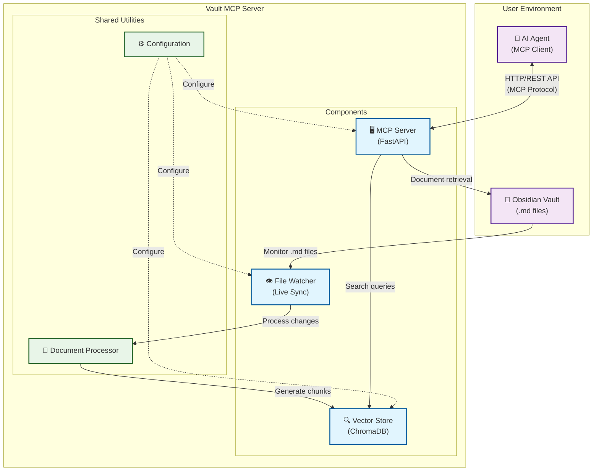

# 🧾 Vault MCP - Obsidian Documentation Server

A **Model Context Protocol (MCP)** compliant server that indexes, searches, and serves Obsidian vault documents with **semantic search (RAG)**, **live synchronization**, and **quality-based chunk filtering**.

## ✨ Features

- 🔍 **Semantic Search**: Vector-based RAG search across your Obsidian vault
- 📁 **Prefix Filtering**: Only index files matching specific filename prefixes
- 🔄 **Live Sync**: Automatically re-indexes files when they change on disk
- 📊 **Quality Scoring**: Filters document chunks based on content quality
- 🔌 **MCP Compliant**: Follows Model Context Protocol standards
- 🚀 **FastAPI Backend**: RESTful API with automatic documentation
- 📝 **Markdown Processing**: Obsidian-friendly markdown parsing

## 🏗️ Architecture



## 🚀 Quick Start

### Prerequisites

This project uses **[uv](https://docs.astral.sh/uv/)** for fast, reliable Python package management. Install uv first:

```bash
# Install uv (recommended method)
curl -LsSf https://astral.sh/uv/install.sh | sh

# Or via pip
pip install uv

# Or via Homebrew (macOS)
brew install uv
```

### 1. Installation

Clone the repository and set up with `uv`:

```bash
git clone <repository-url>
cd vault-mcp

# Create virtual environment with uv
uv venv

# Activate the virtual environment
source .venv/bin/activate  # On Unix/macOS
# or
.venv\Scripts\activate     # On Windows

# Install dependencies with uv
uv sync
```

For development with additional tools:

```bash
# Install with development dependencies
uv sync --extra dev
```

### 2. Configuration

Copy and edit the configuration file:

```bash
cp config/app.toml config/app.local.toml
```

Edit `config/app.local.toml`:

```toml
[paths]
vault_dir = "/path/to/your/obsidian-vault"

[prefix_filter]
allowed_prefixes = [
  "Resource Balance Game",
  "Decentralized Multiplayer Game System",
  "Project Documentation"
]

[indexing]
chunk_size = 512
chunk_overlap = 64
quality_threshold = 0.75

[watcher]
enabled = true
debounce_seconds = 2

[server]
host = "127.0.0.1"
port = 8000
```

### 3. Run the Server

```bash
# Using uvicorn directly
uvicorn components.mcp_server.main:app --reload --host 127.0.0.1 --port 8000

# Or using the installed script (if available)
vault-mcp
```

The server will start and automatically index your vault. Visit `http://localhost:8000/docs` for the interactive API documentation.

## 📋 API Endpoints

### GET `/mcp/info`
Get server capabilities and configuration.

**Response:**
```json
{
  "mcp_version": "1.0",
  "capabilities": ["search", "document_retrieval", "live_sync", "introspection"],
  "indexed_files": ["Resource Balance Game - Goals.md", "..."],
  "config": {
    "chunk_size": 512,
    "overlap": 64,
    "quality_threshold": 0.75
  }
}
```

### GET `/mcp/files`
List all indexed files.

**Response:**
```json
{
  "files": ["Resource Balance Game - Goals.md", "..."],
  "total_count": 15
}
```

### GET `/mcp/document?file_path=...`
Retrieve full document content.

**Parameters:**
- `file_path`: Path to the document file

**Response:**
```json
{
  "content": "# Document Title\n\nDocument content...",
  "file_path": "/path/to/document.md",
  "metadata": null
}
```

### POST `/mcp/query`
Perform semantic search across indexed documents.

**Request:**
```json
{
  "query": "How does the game economy work?",
  "limit": 5
}
```

**Response:**
```json
{
  "answer": "The game economy is based on...",
  "sources": [
    {
      "text": "Economy chunk content...",
      "file_path": "Resource Balance Game - Economy.md",
      "chunk_id": "file|0",
      "score": 0.88
    }
  ]
}
```

### POST `/mcp/reindex`
Force a full re-index of the vault.

**Response:**
```json
{
  "success": true,
  "message": "Reindexing completed",
  "files_processed": 15
}
```

## ⚙️ Configuration Options

### Paths
- `vault_dir`: Absolute path to your Obsidian vault directory

### Prefix Filter
- `allowed_prefixes`: List of filename prefixes to include in indexing
- Empty list = include all `.md` files

### Indexing
- `chunk_size`: Maximum size of text chunks (characters)
- `chunk_overlap`: Overlap between consecutive chunks (characters)
- `quality_threshold`: Minimum quality score for chunks (0.0-1.0)

### Watcher
- `enabled`: Enable/disable live file watching
- `debounce_seconds`: Delay before processing file changes

### Server
- `host`: Server host address
- `port`: Server port number

## 🔧 Development

### Setup Development Environment

```bash
# Clone and set up with uv
git clone <repository-url>
cd vault-mcp

# Create and activate virtual environment
uv venv
source .venv/bin/activate  # Unix/macOS

# Install with development dependencies
uv sync --extra dev

# Run tests
pytest

# Format code
black components/ vault_mcp/
ruff check --fix

# Type checking
mypy components/ vault_mcp/

# Security scanning
bandit -c pyproject.toml -r components/ vault_mcp/
```

### Project Structure

```
vault-mcp/
├── components/              # Discrete system components
│   ├── mcp_server/          # HTTP/REST API server component
│   │   ├── main.py          # FastAPI server and endpoints
│   │   ├── models.py        # API data models
│   │   └── tests/           # Server-specific tests
│   ├── vector_store/        # Document embedding and search component
│   │   ├── vector_store.py  # ChromaDB management
│   │   └── tests/           # Vector store tests
│   └── file_watcher/        # Live file monitoring component
│       ├── file_watcher.py  # File system event handling
│       └── tests/           # File watcher tests
├── vault_mcp/               # Shared utilities and libraries
│   ├── config.py            # Configuration management
│   ├── document_processor.py # Markdown processing and chunking
│   └── __init__.py
├── tests/                   # Root-level integration tests
├── docs/
│   ├── components/          # Component-specific documentation
│   └── plan.md              # Technical specification
├── config/
│   ├── app.toml             # Main application configuration
│   ├── templates.yaml       # Response templates
│   └── prompts.toml         # AI/LLM prompts
├── pyproject.toml           # Project metadata and dependencies
└── README.md                # This file
```

## 🧠 How It Works

1. **Document Ingestion**: The server scans your Obsidian vault for `.md` files matching the configured prefixes.

2. **Markdown Processing**: Each file is parsed using a markdown-aware processor that extracts plain text while preserving structure.

3. **Chunking**: Documents are split into overlapping chunks of configurable size for better semantic search.

4. **Quality Scoring**: Each chunk is scored based on heuristics like length, completeness, structure, and content richness.

5. **Vector Embedding**: High-quality chunks are embedded using a sentence transformer model and stored in ChromaDB.

6. **Live Sync**: A file watcher monitors the vault for changes and automatically updates the index.

7. **Semantic Search**: Queries are embedded and matched against stored chunks using cosine similarity.

## 🎯 Use Cases

- **AI-Powered Documentation**: Enable AI agents to search and reference your project documentation
- **Knowledge Base Search**: Semantic search across your personal knowledge vault
- **Research Assistant**: Quick retrieval of relevant information from large document collections
- **Documentation Sync**: Keep your AI tools synchronized with your latest documentation

## 🔍 Quality Scoring

The server uses several heuristics to score chunk quality:

- **Length Score**: Prefers medium-length chunks (100-800 characters)
- **Completeness**: Rewards chunks with complete sentences
- **Structure**: Favors chunks with headings, lists, or other structural elements
- **Content Richness**: Avoids chunks with excessive punctuation or very short words
- **Coherence**: Rewards good word diversity and topic focus

## 🚨 Troubleshooting

### Common Issues

**Server won't start:**
- Check that the vault directory exists and is accessible
- Verify configuration file syntax
- Ensure all dependencies are installed

**Files not being indexed:**
- Check the `allowed_prefixes` configuration
- Verify file permissions in the vault directory
- Look for error messages in the server logs

**Search returns no results:**
- Try lowering the `quality_threshold`
- Check if files were actually indexed (`/mcp/files`)
- Verify the search query is relevant to your content

**Live sync not working:**
- Ensure `watcher.enabled = true` in configuration
- Check that the vault directory is being monitored
- Look for file watcher error messages in logs

### Logging

The server uses Python's standard logging. To increase verbosity:

```bash
# Set log level to DEBUG
export LOG_LEVEL=DEBUG
uvicorn vault_mcp.main:app --reload
```

## 📊 Performance

- **Dataset Size**: Optimized for <24 files, ~50k tokens
- **Memory Usage**: Embeddings and vector store fit comfortably in RAM
- **Startup Time**: ~1-2 seconds for cold start
- **Search Latency**: Sub-second semantic search responses
- **File Watching**: Low CPU usage due to debouncing

## 🤝 Contributing

1. Fork the repository
2. Create a feature branch (`git checkout -b feature/amazing-feature`)
3. Commit your changes (`git commit -m 'Add amazing feature'`)
4. Push to the branch (`git push origin feature/amazing-feature`)
5. Open a Pull Request

## 📄 License

This project is licensed under the MIT License - see the LICENSE file for details.

## 🙏 Acknowledgments

- [FastAPI](https://fastapi.tiangolo.com/) for the excellent web framework
- [ChromaDB](https://www.trychroma.com/) for vector storage and retrieval
- [Sentence Transformers](https://www.sbert.net/) for embedding generation
- [Watchdog](https://github.com/gorakhargosh/watchdog) for file system monitoring
- [Mistune](https://mistune.lepture.com/) for markdown parsing

---

**Happy documenting! 📚✨**
