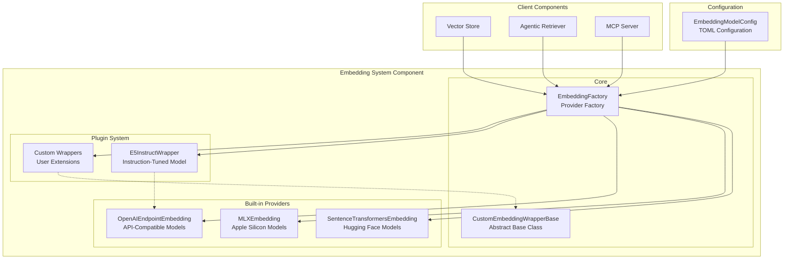

# Embedding System Component

## Overview

The embedding system component provides a flexible, pluggable architecture for managing document embeddings in the vault-mcp server. It supports multiple embedding providers, custom wrapper implementations, and specialized handling for instruction-tuned models.

## Architecture



## Components

### Core Components

#### CustomEmbeddingWrapperBase
- **Purpose**: Abstract base class for pluggable embedding wrappers
- **Location**: `components/embedding_system/custom_embedding.py`
- **Interface**: Defines the contract for custom embedding implementations
- **Usage**: Extended by plugin wrappers to provide specialized functionality

#### EmbeddingFactory
- **Purpose**: Factory for creating embedding models based on configuration
- **Location**: `components/embedding_system/embedding_factory.py`
- **Features**:
  - Dynamic plugin loading via `importlib`
  - Support for multiple provider backends
  - Configuration-driven model instantiation
  - Error handling and fallback logic

### Built-in Providers

#### SentenceTransformersEmbedding
- **Provider**: `sentence_transformers`
- **Backend**: Hugging Face Sentence Transformers
- **Use Cases**: Local embedding models, offline deployment
- **Configuration**:
  ```toml
  [embedding_model]
  provider = "sentence_transformers"
  model_name = "all-MiniLM-L6-v2"
  ```

#### MLXEmbedding
- **Provider**: `mlx_embeddings`
- **Backend**: Apple MLX framework (experimental)
- **Use Cases**: Apple Silicon optimization
- **Configuration**:
  ```toml
  [embedding_model]
  provider = "mlx_embeddings"
  model_name = "mlx-community/mxbai-embed-large-v1"
  ```

#### OpenAIEndpointEmbedding
- **Provider**: `openai_endpoint`
- **Backend**: OpenAI-compatible API endpoints
- **Use Cases**: Cloud providers, local API servers (Ollama, vLLM)
- **Configuration**:
  ```toml
  [embedding_model]
  provider = "openai_endpoint"
  model_name = "nomic-embed-text"
  endpoint_url = "http://localhost:11434/v1"
  api_key = "your-api-key"
  ```

### Plugin System

The plugin system allows for custom embedding wrappers to be dynamically loaded and used. This enables specialized handling for instruction-tuned models, custom preprocessing, and provider-specific optimizations.

#### Plugin Configuration
```toml
[embedding_model]
provider = "openai_endpoint"
model_name = "custom-model"
endpoint_url = "http://localhost:11434/v1"
api_key = "your-api-key"
wrapper_class = "plugins.custom_wrapper.CustomWrapper"
```

#### Plugin Implementation
```python
from components.embedding_system import OpenAIEndpointEmbedding
from vault_mcp.config import EmbeddingModelConfig

class CustomWrapper(OpenAIEndpointEmbedding):
    def __init__(self, config: EmbeddingModelConfig, **kwargs):
        super().__init__(
            model_name=config.model_name,
            endpoint_url=config.endpoint_url,
            api_key=config.api_key,
            **kwargs,
        )

    def _get_query_embedding(self, query: str) -> List[float]:
        # Custom query preprocessing
        processed_query = self._preprocess_query(query)
        return super()._get_query_embedding(processed_query)
```

## Example: E5-Instruct Wrapper

The E5-Instruct wrapper demonstrates advanced plugin functionality for instruction-tuned embedding models:

### Features
- **JSON Query Parsing**: Handles structured queries with custom instructions
- **Instruction Formatting**: Formats queries in E5-instruct format
- **Fallback Handling**: Uses default instruction for plain text queries

### Usage
```python
# JSON query with custom instruction
query = {
    "instruction": "Find documents about machine learning techniques",
    "query": "neural networks"
}

# Plain text query (uses default instruction)
query = "machine learning"
```

### Implementation Details
```python
def _get_query_embedding(self, query: str) -> List[float]:
    default_instruction = "Given a user query, retrieve the most relevant document chunks."
    final_query = query
    instruction = default_instruction

    try:
        payload = json.loads(query)
        if isinstance(payload, dict) and "instruction" in payload and "query" in payload:
            instruction = payload["instruction"]
            final_query = payload["query"]
    except (json.JSONDecodeError, TypeError):
        pass  # Use default instruction

    formatted_query = f"Instruct: {instruction}\nQuery: {final_query}"
    return OpenAIEndpointEmbedding._get_query_embedding(self, formatted_query)
```

## Configuration

### EmbeddingModelConfig
The configuration model supports all provider types and plugin functionality:

```python
class EmbeddingModelConfig(BaseModel):
    provider: str = Field(default="sentence_transformers")
    model_name: str = Field(default="all-MiniLM-L6-v2")
    endpoint_url: Optional[str] = Field(default=None)
    api_key: Optional[str] = Field(default=None)
    wrapper_class: Optional[str] = Field(default=None)
```

### Configuration Examples

#### Local SentenceTransformers
```toml
[embedding_model]
provider = "sentence_transformers"
model_name = "all-MiniLM-L6-v2"
```

#### Ollama with E5-Instruct
```toml
[embedding_model]
provider = "openai_endpoint"
model_name = "yoeven/multilingual-e5:large-it-Q5_K_M"
endpoint_url = "http://localhost:11434/v1"
api_key = "ollama"
wrapper_class = "plugins.e5_instruct_wrapper.E5InstructWrapper"
```

#### OpenAI Embeddings
```toml
[embedding_model]
provider = "openai_endpoint"
model_name = "text-embedding-3-small"
endpoint_url = "https://api.openai.com/v1"
api_key = "your-openai-api-key"
```

## Testing

### Component Tests
The embedding system includes comprehensive tests covering:

- **Model Creation**: Factory instantiation with different configurations
- **Plugin Loading**: Dynamic loading of custom wrappers
- **Query Processing**: Instruction parsing and formatting
- **Error Handling**: Graceful fallback for invalid configurations

### Running Tests
```bash
# Run embedding system tests
python -m pytest components/embedding_system/tests/ -v

# Run integration tests
python -m pytest tests/test_integration.py::test_embedding_system -v
```

### Test Coverage
- **Factory Pattern**: Configuration-driven model creation
- **Plugin System**: Dynamic wrapper loading and instantiation
- **Instruction Processing**: JSON query parsing and formatting
- **Provider Backends**: Multiple embedding provider compatibility

## Integration

### Vector Store Integration
The embedding system integrates seamlessly with the vector store component:

```python
from components.embedding_system import create_embedding_model
from components.vector_store import VectorStore

# Create embedding model from configuration
embedding_model = create_embedding_model(config.embedding_model)

# Initialize vector store with embedding model
vector_store = VectorStore(
    embedding_config=config.embedding_model,
    persist_directory=config.paths.database_dir,
)
```

### Agentic Retriever Integration
The agentic retriever uses the embedding system for query processing:

```python
from components.embedding_system import create_embedding_model

# Create embedding model for LlamaIndex integration
embedding_model = create_embedding_model(config.embedding_model)
Settings.embed_model = embedding_model
```

## Performance Considerations

### Provider Selection
- **SentenceTransformers**: Best for offline deployment, CPU/GPU flexibility
- **MLX**: Optimized for Apple Silicon, experimental
- **OpenAI Endpoint**: Scalable for cloud deployment, requires network access

### Caching and Optimization
- **Model Loading**: Models are cached after first instantiation
- **Query Batching**: Built-in support for batch embedding generation
- **Memory Management**: Efficient handling of large model files

## Security Considerations

### API Key Management
- **Environment Variables**: Store API keys in environment variables
- **Configuration Files**: Keep sensitive data out of version control
- **Access Control**: Restrict API endpoint access appropriately

### Network Security
- **HTTPS Endpoints**: Use encrypted connections for cloud providers
- **Local Deployment**: Consider local models for sensitive data
- **API Rate Limiting**: Implement appropriate rate limiting for external APIs

## Troubleshooting

### Common Issues

#### Plugin Loading Errors
```python
# Error: Module not found
# Solution: Ensure plugin is in Python path
sys.path.append('/path/to/plugins')

# Error: Class not found
# Solution: Check wrapper_class configuration
wrapper_class = "plugins.module_name.ClassName"
```

#### Model Loading Failures
```python
# Error: Model not found
# Solution: Verify model name and availability
model_name = "sentence-transformers/all-MiniLM-L6-v2"

# Error: API connection failed
# Solution: Check endpoint URL and API key
endpoint_url = "http://localhost:11434/v1"
api_key = "valid-api-key"
```

#### Performance Issues
- **Large Models**: Consider model quantization or smaller variants
- **Network Latency**: Use local deployment for real-time applications
- **Memory Usage**: Monitor memory consumption with large batch sizes

## Future Enhancements

### Planned Features
- **Model Quantization**: Support for quantized model variants
- **Batch Processing**: Enhanced batch embedding capabilities
- **Caching Layer**: Persistent embedding cache for improved performance
- **Multi-Provider**: Simultaneous use of multiple embedding providers

### Extension Points
- **Custom Providers**: Additional embedding backend support
- **Preprocessing Pipelines**: Advanced text preprocessing chains
- **Quality Metrics**: Embedding quality assessment and validation
- **Model Serving**: Dedicated embedding server deployment
